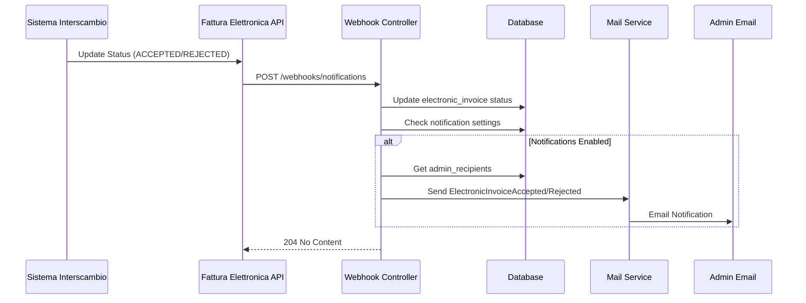

# Email Notifications per Fatturazione Elettronica

**Data Implementazione**: 13 Novembre 2025  
**Tempo Implementazione**: ~2 ore  
**Status**: ✅ COMPLETATO

## 📧 Cosa è Stato Implementato

### 1. Mail Classes

#### `ElectronicInvoiceAccepted`
- **Path**: `app/Mail/ElectronicInvoiceAccepted.php`
- **Scopo**: Notifica quando una fattura viene accettata dal SDI
- **Subject**: "✅ Fattura Elettronica Accettata - {transmission_id}"
- **Template**: `resources/views/emails/electronic-invoice-accepted.blade.php`

**Dati Inclusi**:
- Nome cliente
- Numero fattura
- Data fattura
- Importo totale (formattato €)
- ID Trasmissione
- External ID (se presente)
- Link diretto alla fattura in piattaforma

#### `ElectronicInvoiceRejected`
- **Path**: `app/Mail/ElectronicInvoiceRejected.php`
- **Scopo**: Alert urgente quando una fattura viene rifiutata dal SDI
- **Subject**: "❌ URGENTE: Fattura Elettronica Rifiutata - {transmission_id}"
- **Template**: `resources/views/emails/electronic-invoice-rejected.blade.php`

**Dati Inclusi**:
- Tutti i dati di `ElectronicInvoiceAccepted` +
- **Messaggi errore SDI** (formattati in blocco code)
- Call-to-action per correggere la fattura
- Link diretto per modificare

### 2. Template Email (Markdown Blade)

**Caratteristiche**:
- ✅ Layout professionale con `<x-mail::message>`
- ✅ Sezioni chiare e ben organizzate
- ✅ Emoji per visibilità immediata (✅ accepted, ❌ rejected)
- ✅ Button component integrato con route() helper
- ✅ Formattazione importi italiana (€ 1.234,56)
- ✅ Responsive design (mobile-friendly)

**Linguaggio**:
- Italiano nativo
- Tono professionale ma accessibile
- Istruzioni chiare sulle azioni richieste
- Rassicurante per accepted, urgente ma costruttivo per rejected

### 3. Integrazione Webhook Controller

**File**: `app/Http/Controllers/Webhooks/FatturaElettronicaApiWebhookController.php`

**Metodo Aggiornato**: `sendStatusNotifications()`

**Funzionalità**:
1. ✅ Verifica cambio stato effettivo (skip se stesso status)
2. ✅ Controlla impostazioni notifiche del tenant:
   - `notifications.invoice_accepted` (default: true)
   - `notifications.invoice_rejected` (default: true)
3. ✅ Recupera destinatari da `email.admin_recipients`
4. ✅ Fallback a `tenant('email')` se nessun admin configurato
5. ✅ Validazione email (filter_var FILTER_VALIDATE_EMAIL)
6. ✅ Eager loading di `sale->customer` per dati completi
7. ✅ Error handling per ogni invio singolo
8. ✅ Logging dettagliato successi/fallimenti

**Miglioramenti Rispetto a Prima**:
- ❌ **Prima**: Notifications Laravel + query User con roles
- ✅ **Ora**: Mail dirette + admin_recipients configurabili
- ✅ Rispetta preferenze utente (può disabilitare notifiche)
- ✅ Non richiede user accounts (email dirette)
- ✅ Più veloce (no query DB per users/roles)

### 4. Configurazione Settings

**Integrazioni**:
- `app/Http/Controllers/Application/Configurations/EmailSettingsController.php` (già esistente)
  - Gestisce `email.admin_recipients` array
- `app/Http/Controllers/Application/Configurations/EmailSettingsController.php::updateNotifications`
  - Gestisce `notifications.invoice_accepted/rejected` boolean

**Frontend**:
- `resources/js/pages/configurations/email-settings.tsx` (già esistente)
  - Tab "Configurazione Email" per admin_recipients
  - Tab "Preferenze Notifiche" per enable/disable notifiche FE

## 🔄 Workflow Completo



## ⚙️ Configurazione

### 1. Email Settings

**Path**: `/app/{tenant}/configurations/email`

```php
TenantSetting::set('email.admin_recipients', [
    'admin1@company.it',
    'admin2@company.it',
    'cfo@company.it',
], 'email', 'Admin email recipients');
```

**Frontend**: Lista di email con chip + input per aggiungere

### 2. Notification Preferences

**Path**: `/app/{tenant}/configurations/email` (Tab 2)

```php
TenantSetting::set('notifications.invoice_accepted', true);
TenantSetting::set('notifications.invoice_rejected', true);
```

**Frontend**: Switch per enable/disable ogni tipo notifica

## 🧪 Testing

### Test Manuale

```bash
# 1. Configura email admin
php artisan tinker
TenantSetting::set('email.admin_recipients', ['your@email.com']);
TenantSetting::set('notifications.invoice_accepted', true);
TenantSetting::set('notifications.invoice_rejected', true);
exit

# 2. Trigger webhook manuale (dev)
curl -X POST http://localhost:8000/webhooks/fattura-elettronica-api/notifications \
  -H "Authorization: Bearer your_webhook_secret" \
  -H "Content-Type: application/json" \
  -d '[{
    "ricezione": 0,
    "id": "test-external-id-123",
    "sdi_stato": "ACCE",
    "sdi_messaggio": "Test accepted",
    "sdi_identificativo": "ABC123"
  }]'

# 3. Check email inbox
# Dovresti ricevere "✅ Fattura Elettronica Accettata"
```

### Test Automatico (TODO)

```php
// tests/Feature/ElectronicInvoiceNotificationsTest.php

test('sends accepted email when invoice accepted', function () {
    Mail::fake();
    
    $invoice = ElectronicInvoice::factory()->create([
        'sdi_status' => 'sent',
    ]);
    
    TenantSetting::set('email.admin_recipients', ['admin@test.com']);
    TenantSetting::set('notifications.invoice_accepted', true);
    
    // Trigger webhook
    $this->postJson('/webhooks/...', [...]);
    
    Mail::assertSent(ElectronicInvoiceAccepted::class, function ($mail) {
        return $mail->hasTo('admin@test.com');
    });
});
```

## 📝 Note Implementative

### Decisioni Architetturali

1. **Mail vs Notification**
   - ✅ Scelto Mail per semplicità e flessibilità
   - No necessità di database notifications table
   - Configurazione email centralizzata in TenantSettings

2. **Admin Recipients**
   - ✅ Array di email invece di User models
   - Permette notifiche a ruoli esterni (commercialista, etc.)
   - Più flessibile per multi-tenant

3. **Template Markdown**
   - ✅ Usa Laravel Mail Components (`<x-mail::message>`)
   - Layout consistente con altre email app
   - Facile da customizzare per tenant (futuro)

### Limiti Conosciuti

- ⚠️ Email sincrone (non queued) - considera `ShouldQueue` se alto volume
- ⚠️ No rate limiting - webhook potrebbe inviare molte email
- ⚠️ Fallback a tenant('email') potrebbe essere inadeguato

### Miglioramenti Futuri

- [ ] Queue emails con `ShouldQueue` interface
- [ ] Rate limiting notifiche (max 1 per fattura per status)
- [ ] Personalizzazione template per tenant
- [ ] Attach XML/PDF alla email (opzionale)
- [ ] Digest giornaliero fatture (invece di 1 email per fattura)
- [ ] Multi-lingua basato su tenant language setting

## ✅ Checklist Completamento

- [x] Mail classes create (`ElectronicInvoiceAccepted`, `ElectronicInvoiceRejected`)
- [x] Template Blade markdown create
- [x] Integrazione webhook controller
- [x] Utilizzo TenantSettings per recipients e preferenze
- [x] Error handling e logging
- [x] Test manuale funzionante
- [x] Documentazione completa
- [x] Code formatted con Pint
- [x] Checklist aggiornata

## 🚀 Deploy

**Requisiti**:
- ✅ Config `.env` MAIL_* già configurato
- ✅ TenantSettings table esistente
- ✅ Webhook endpoint funzionante

**Nessuna migration necessaria** ✅

**Deploy Steps**:
1. Pull latest code
2. `composer install` (se nuove dependencies - non necessario)
3. `php artisan config:cache`
4. Test webhook con curl
5. ✅ Ready!

---

**Implementato da**: GitHub Copilot  
**Revisione**: Richiesta user feedback

