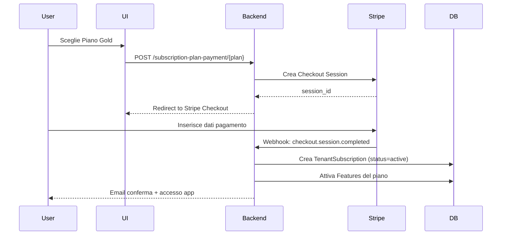
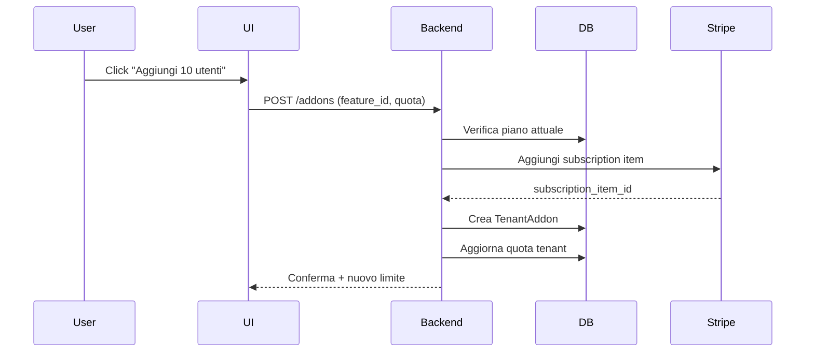
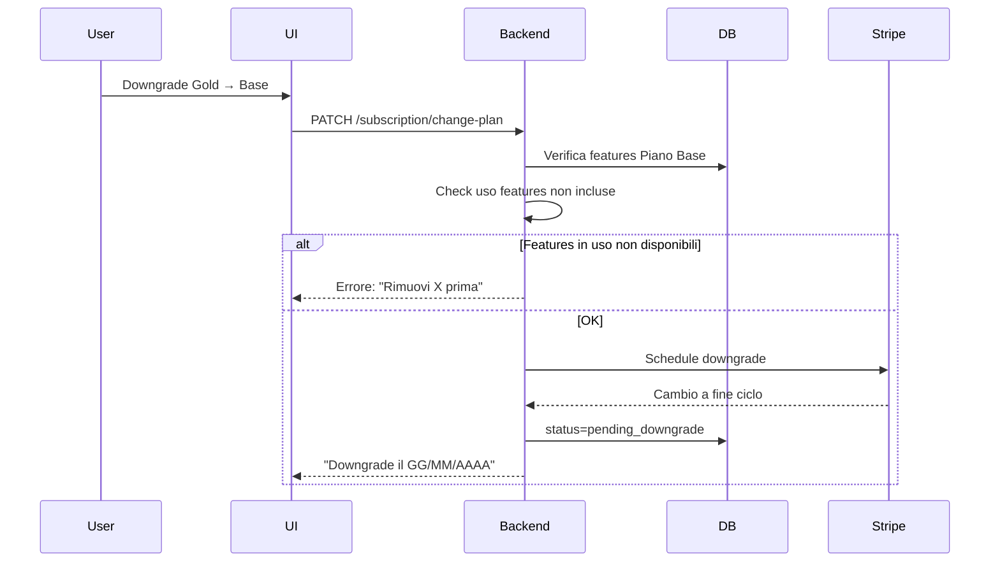

# Sistema Abbonamenti - Documentazione Completa

## Indice
1. [Panoramica del Sistema](#panoramica-del-sistema)
2. [Architettura Database](#architettura-database)
3. [Modelli e Relazioni](#modelli-e-relazioni)
4. [Subscription Plans (Piani Abbonamento)](#subscription-plans-piani-abbonamento)
5. [Plan Features (Caratteristiche)](#plan-features-caratteristiche)
6. [Tenant Addons](#tenant-addons)
7. [Flussi Operativi](#flussi-operativi)
8. [Integrazione Stripe](#integrazione-stripe)

---

## Panoramica del Sistema

Il sistema di abbonamenti di Gymme è progettato per gestire un modello SaaS multi-tier con:
- **Piani base** a diversi livelli (Base, Gold, Platinum)
- **Features modulari** che possono essere incluse nei piani o acquistate separatamente
- **Addons acquistabili** per estendere le funzionalità oltre i limiti del piano
- **Periodi di prova** configurabili per piano
- **Integrazione Stripe** per pagamenti automatici

---

## Architettura Database

### Tabelle Principali

#### `subscription_plans`
Definisce i piani abbonamento disponibili.

| Campo | Tipo | Descrizione |
|-------|------|-------------|
| `id` | bigint | ID univoco |
| `name` | varchar(255) | Nome del piano (es. "Piano Base") |
| `slug` | varchar(255) | Identificatore URL-friendly (es. "piano-base") |
| `description` | text | Descrizione dettagliata del piano |
| `price` | integer | **Prezzo in centesimi** (es. 4900 = €49.00) |
| `currency` | varchar(10) | Valuta (default: EUR) |
| `interval` | enum | Frequenza fatturazione: `monthly`, `yearly`, `weekly`, `daily` |
| `trial_days` | integer | Giorni di prova gratuita (0-365) |
| `tier` | enum | Livello piano: `base`, `gold`, `platinum` |
| `is_trial_plan` | boolean | Piano dedicato al trial (gratuito) |
| `is_active` | boolean | Piano disponibile per nuove sottoscrizioni |
| `sort_order` | integer | Ordine visualizzazione UI |
| `stripe_price_id` | varchar(255) | ID prezzo su Stripe (es. `price_1234567890`) |

**Esempio:**
```php
SubscriptionPlan::create([
    'name' => 'Piano Gold',
    'slug' => 'gold',
    'description' => 'Perfetto per palestre di medie dimensioni',
    'price' => 9900, // €99.00
    'currency' => 'EUR',
    'interval' => 'monthly',
    'trial_days' => 14,
    'tier' => 'gold',
    'is_active' => true,
    'stripe_price_id' => 'price_xyz123',
]);
```

---

#### `plan_features`
Definisce le funzionalità disponibili nel sistema.

| Campo | Tipo | Descrizione |
|-------|------|-------------|
| `id` | bigint | ID univoco |
| `name` | varchar(255) | Codice identificativo (es. `max_users`, `storage_gb`) |
| `display_name` | varchar(255) | Nome visualizzato (es. "Utenti Massimi") |
| `description` | text | Descrizione funzionalità |
| `feature_type` | enum | Tipo: `boolean`, `quota`, `metered` |
| `is_addon_purchasable` | boolean | Acquistabile come addon separato |
| `default_addon_price_cents` | integer | Prezzo addon predefinito (centesimi) |
| `default_addon_quota` | integer | Quota addon predefinita |
| `is_active` | boolean | Feature attiva e disponibile |
| `sort_order` | integer | Ordine visualizzazione UI |

**Tipi di Feature:**

1. **Boolean** (`feature_type='boolean'`)
   - On/Off, presente o assente
   - Esempio: "Fatturazione Elettronica", "Report Avanzati"
   - **Pivot**: Solo `is_included` (true/false)

2. **Quota** (`feature_type='quota'`)
   - Con limite quantitativo
   - Esempio: "Max 50 Utenti", "10 GB Storage"
   - **Pivot**: `is_included` + `quota_limit` (numero)

3. **Metered** (`feature_type='metered'`)
   - Basato sul consumo effettivo (pay-per-use)
   - Esempio: "Email inviate", "SMS"
   - **Pivot**: `is_included` + `price_cents` per unità

**Esempio:**
```php
PlanFeature::create([
    'name' => 'max_users',
    'display_name' => 'Utenti Massimi',
    'description' => 'Numero massimo di utenti attivi contemporaneamente',
    'feature_type' => 'quota',
    'is_addon_purchasable' => true,
    'default_addon_price_cents' => 500, // €5.00 per 10 utenti extra
    'default_addon_quota' => 10,
    'is_active' => true,
]);
```

---

#### `subscription_plan_features` (Pivot)
Collega features ai piani con configurazione specifica.

| Campo | Tipo | Descrizione |
|-------|------|-------------|
| `subscription_plan_id` | bigint | ID piano |
| `plan_feature_id` | bigint | ID feature |
| `is_included` | boolean | **Incluso nel prezzo base** del piano |
| `quota_limit` | integer | Limite (per feature `quota`), null = illimitato |
| `price_cents` | integer | Prezzo addon specifico per questo piano (centesimi) |

**Logica Importante:**

- **`is_included = true`**: Feature inclusa nel canone mensile
  - Esempio: Piano Gold include 50 utenti
  - L'utente non paga extra finché resta sotto il limite

- **`is_included = false`**: Feature NON inclusa, disponibile solo come addon
  - Esempio: Piano Base non include fatturazione elettronica
  - L'utente deve acquistarla separatamente

- **`quota_limit`**:
  - `null` o `0` = illimitato
  - Numero positivo = limite specifico
  - Esempio: Gold con `quota_limit=50` per `max_users`

- **`price_cents`**: Prezzo addon per QUESTO specifico piano
  - Se null, usa `default_addon_price_cents` dalla tabella `plan_features`
  - Permette pricing differenziato per piano

**Esempi:**

```php
// Piano Gold: 50 utenti inclusi
$goldPlan->features()->attach($maxUsersFeature->id, [
    'is_included' => true,
    'quota_limit' => 50,
    'price_cents' => 500, // €5.00 per pacchetto da 10 extra
]);

// Piano Base: fatturazione elettronica NON inclusa, acquistabile
$basePlan->features()->attach($electronicInvoicingFeature->id, [
    'is_included' => false,
    'quota_limit' => null,
    'price_cents' => 1500, // €15.00/mese come addon
]);

// Piano Platinum: utenti illimitati
$platinumPlan->features()->attach($maxUsersFeature->id, [
    'is_included' => true,
    'quota_limit' => null, // illimitato
    'price_cents' => null,
]);
```

---

#### `tenant_subscriptions`
Sottoscrizioni attive dei tenant.

| Campo | Tipo | Descrizione |
|-------|------|-------------|
| `id` | bigint | ID univoco |
| `tenant_id` | varchar(255) | ID tenant (stancl/tenancy) |
| `subscription_plan_id` | bigint | Piano sottoscritto |
| `starts_at` | timestamp | Data inizio abbonamento |
| `ends_at` | timestamp | Data scadenza (null = attivo) |
| `trial_ends_at` | timestamp | Fine periodo prova |
| `status` | enum | `active`, `trial`, `canceled`, `expired`, `past_due` |
| `payment_method` | enum | `stripe`, `bank_transfer` |
| `stripe_subscription_id` | varchar(255) | ID sottoscrizione Stripe |
| `stripe_customer_id` | varchar(255) | ID customer Stripe |
| `auto_renew` | boolean | Rinnovo automatico |

---

#### `tenant_addons`
Addons acquistati dai tenant oltre al piano base.

| Campo | Tipo | Descrizione |
|-------|------|-------------|
| `id` | bigint | ID univoco |
| `tenant_id` | varchar(255) | ID tenant |
| `plan_feature_id` | bigint | Feature acquistata |
| `quota_limit` | integer | Quota addon (es. +10 utenti) |
| `price_cents` | integer | Prezzo pagato (centesimi) |
| `starts_at` | timestamp | Data attivazione |
| `ends_at` | timestamp | Data scadenza |
| `is_active` | boolean | Addon attivo |
| `stripe_subscription_item_id` | varchar(255) | ID item su Stripe |
| `payment_method` | enum | `stripe`, `bank_transfer` |
| `status` | enum | `active`, `canceled`, `expired` |

**Esempio Scenario:**
```
Tenant ha Piano Gold (50 utenti inclusi)
Cresce e raggiunge 48 utenti
Acquista addon "+10 utenti" per €5/mese
Ora ha quota totale: 50 + 10 = 60 utenti
```

---

#### `subscription_payments`
Storico pagamenti (usato principalmente per bank_transfer).

| Campo | Tipo | Descrizione |
|-------|------|-------------|
| `id` | bigint | ID univoco |
| `tenant_id` | varchar(255) | ID tenant |
| `subscription_plan_id` | bigint | Piano pagato |
| `amount_cents` | integer | Importo (centesimi) |
| `payment_method` | enum | `stripe`, `bank_transfer` |
| `status` | enum | `pending`, `confirmed`, `failed`, `refunded` |
| `stripe_payment_intent_id` | varchar(255) | ID Stripe PaymentIntent |
| `paid_at` | timestamp | Data pagamento confermato |
| `confirmed_at` | timestamp | Data conferma admin (bank_transfer) |
| `confirmed_by` | bigint | Admin che ha confermato |

---

## Modelli e Relazioni

### SubscriptionPlan

```php
// Relazioni
public function features(): BelongsToMany
// Pivot: subscription_plan_features (is_included, quota_limit, price_cents)

public function subscriptions(): HasMany
// tenant_subscriptions.subscription_plan_id

// Scope
public function scopeActive($query)
// Solo piani attivi (is_active = true)

public function scopeTier($query, $tier)
// Filtra per tier (base, gold, platinum)
```

### PlanFeature

```php
// Relazioni
public function subscriptionPlans(): BelongsToMany
// Alias: plans()

public function tenantAddons(): BelongsToMany
// Addons acquistati dai tenant

// Scope
public function scopeActive($query)
// Solo feature attive

public function scopeAddonPurchasable($query)
// Solo feature acquistabili come addon
```

### TenantSubscription

```php
// Relazioni
public function plan(): BelongsTo

public function tenant(): BelongsTo

// Metodi
public function isActive(): bool
public function isTrial(): bool
public function cancel(): void
public function resume(): void
```

---

## Subscription Plans (Piani Abbonamento)

### Campi Spiegati

#### `price` (integer)
**IMPORTANTE: Sempre in centesimi**
- €49.00 → `price = 4900`
- €99.99 → `price = 9999`
- Gratuito → `price = 0`

**Motivo:** Evita problemi di arrotondamento con decimali

#### `interval` (enum)
Frequenza di fatturazione:
- `monthly`: Mensile (più comune)
- `yearly`: Annuale (con sconto)
- `weekly`: Settimanale (raro)
- `daily`: Giornaliero (per test)

#### `trial_days` (integer)
Giorni di prova gratuita PER QUESTO PIANO:
- `0`: Nessun trial
- `14`: 2 settimane gratis
- `30`: 1 mese gratis

**Logica:**
- Ogni piano può avere trial diverso
- Trial inizia al momento della sottoscrizione
- Dopo il trial, addebito automatico (se Stripe)

#### `tier` (enum)
Livello di servizio commerciale:
- `base`: Entry level, funzionalità limitate
- `gold`: Livello intermedio, più features
- `platinum`: Livello premium, tutte le features

**Uso:**
- Ordinamento UI (mostra prima tier più alto)
- Marketing (badge "Piano Gold")
- Logica business (upgrade/downgrade path)

#### `is_trial_plan` (boolean)
Piano dedicato SOLO al trial:
- `true`: Piano "Prova Gratuita" standalone
  - Usato per onboarding
  - Limiti molto bassi
  - Non rinnovabile
- `false`: Piano normale acquistabile

**Esempio Scenario:**
```
Piano Trial Gratuito: is_trial_plan=true, price=0, trial_days=30
Piano Base: is_trial_plan=false, price=4900, trial_days=14
```

#### `is_active` (boolean)
Visibilità del piano:
- `true`: Disponibile per nuove sottoscrizioni
- `false`: Non più acquistabile (ma abbonamenti esistenti continuano)

**Caso d'uso:**
```
Hai creato Piano Gold v1 (attivo)
Crei Piano Gold v2 con più features
Disattivi v1 (is_active=false)
Clienti esistenti su v1 continuano
Nuovi clienti vedono solo v2
```

#### `stripe_price_id` (varchar)
ID del Price Object su Stripe:
- Formato: `price_1234567890abcdef`
- Necessario per Stripe Checkout
- Creato nel dashboard Stripe o via API

**Setup:**
1. Crei piano su Stripe con prezzo e intervallo
2. Copi il `price_id`
3. Lo salvi in `stripe_price_id`
4. Sistema usa questo ID per creare sottoscrizioni

---

## Plan Features (Caratteristiche)

### Tipi di Feature Dettagliati

#### 1. Boolean Features
```php
[
    'name' => 'electronic_invoicing',
    'display_name' => 'Fatturazione Elettronica',
    'feature_type' => 'boolean',
]
```

**Configurazione Pivot:**
```php
// Piano Gold: INCLUDE fatturazione elettronica
'is_included' => true,
'quota_limit' => null,    // ignorato per boolean
'price_cents' => null,    // nessun costo extra

// Piano Base: NON include, acquistabile come addon
'is_included' => false,
'quota_limit' => null,
'price_cents' => 1500,    // €15/mese se acquistato
```

**Controllo Runtime:**
```php
$tenant->hasFeature('electronic_invoicing')
// true → può usare fatturazione elettronica
// false → mostra paywall "Upgrade o Acquista Addon"
```

---

#### 2. Quota Features
```php
[
    'name' => 'max_users',
    'display_name' => 'Utenti Massimi',
    'feature_type' => 'quota',
    'default_addon_quota' => 10,
    'default_addon_price_cents' => 500, // €5 per 10 utenti
]
```

**Configurazione Pivot:**
```php
// Piano Base: 5 utenti inclusi
'is_included' => true,
'quota_limit' => 5,
'price_cents' => 500,

// Piano Gold: 50 utenti inclusi
'is_included' => true,
'quota_limit' => 50,
'price_cents' => 500,

// Piano Platinum: utenti ILLIMITATI
'is_included' => true,
'quota_limit' => null,  // null = unlimited
'price_cents' => null,
```

**Controllo Runtime:**
```php
$currentUsers = $tenant->users()->count(); // 48
$limit = $tenant->getFeatureLimit('max_users'); // 50

if ($currentUsers >= $limit) {
    // Mostra paywall: "Hai raggiunto il limite. Acquista addon +10 utenti"
}
```

**Addon Purchase:**
```php
$tenant->purchaseAddon('max_users', [
    'quota' => 10,
    'price_cents' => 500,
]);
// Nuovo limite: 50 + 10 = 60
```

---

#### 3. Metered Features
```php
[
    'name' => 'sms_sent',
    'display_name' => 'SMS Inviati',
    'feature_type' => 'metered',
    'default_addon_price_cents' => 10, // €0.10 per SMS
]
```

**Configurazione Pivot:**
```php
// Piano Base: 100 SMS inclusi/mese
'is_included' => true,
'quota_limit' => 100,
'price_cents' => 10,  // €0.10 per SMS oltre il limite

// Piano Gold: 500 SMS inclusi, poi pay-per-use
'is_included' => true,
'quota_limit' => 500,
'price_cents' => 8,   // €0.08 per SMS (scontato)
```

**Tracciamento Consumo:**
```php
// Ogni SMS inviato
$tenant->recordUsage('sms_sent', 1);

// Fine mese
$used = $tenant->getUsage('sms_sent'); // 520
$included = $tenant->getFeatureLimit('sms_sent'); // 500
$overage = $used - $included; // 20
$cost = $overage * 8; // €1.60 extra
```

---

### Addons Acquistabili

#### `is_addon_purchasable` (boolean)
- `true`: Feature può essere acquistata separatamente
- `false`: Disponibile SOLO tramite upgrade piano

**Esempio:**
```php
// Fatturazione Elettronica: addon acquistabile
'is_addon_purchasable' => true,
// Cliente può:
// 1. Upgrade a piano che la include
// 2. Acquistarla come addon al piano attuale

// Multi-Tenant: NON addon (solo Platinum)
'is_addon_purchasable' => false,
// Cliente deve fare upgrade a Platinum
```

#### `default_addon_price_cents` & `default_addon_quota`
Valori predefiniti quando si acquista addon:
```php
'default_addon_price_cents' => 1500,  // €15/mese
'default_addon_quota' => 50,           // 50 unità

// Nel pivot del piano si può override:
'price_cents' => 1200,  // €12/mese per Piano Gold (sconto)
```

---

## Tenant Addons

### Lifecycle Addon

#### 1. Acquisto
```php
$addon = TenantAddon::create([
    'tenant_id' => $tenant->id,
    'plan_feature_id' => $feature->id,
    'quota_limit' => 10,
    'price_cents' => 500,
    'starts_at' => now(),
    'ends_at' => now()->addMonth(),
    'is_active' => true,
    'payment_method' => 'stripe',
    'status' => 'active',
]);

// Se Stripe
$addon->stripe_subscription_item_id = $stripeItem->id;
```

#### 2. Rinnovo
```php
// Auto-renew via Stripe webhook
// Oppure manuale:
$addon->update([
    'ends_at' => $addon->ends_at->addMonth(),
    'status' => 'active',
]);
```

#### 3. Cancellazione
```php
$addon->update([
    'is_active' => false,
    'status' => 'canceled',
    // ends_at rimane invariato (attivo fino a scadenza)
]);
```

---

## Flussi Operativi

### Flusso 1: Nuova Sottoscrizione



### Flusso 2: Acquisto Addon



### Flusso 3: Downgrade Piano



---

## Integrazione Stripe

### Webhook Eventi Critici

#### `checkout.session.completed`
Nuova sottoscrizione completata:
```php
$session = $event->data->object;
$subscription = TenantSubscription::create([
    'stripe_subscription_id' => $session->subscription,
    'stripe_customer_id' => $session->customer,
    'status' => 'trial', // se trial_days > 0
]);
```

#### `customer.subscription.updated`
Cambio piano, rinnovo, cancellazione:
```php
$subscription = $event->data->object;
TenantSubscription::where('stripe_subscription_id', $subscription->id)
    ->update([
        'status' => $subscription->status,
        'ends_at' => $subscription->current_period_end,
    ]);
```

#### `invoice.payment_failed`
Pagamento fallito:
```php
TenantSubscription::where('stripe_subscription_id', $subscription->id)
    ->update(['status' => 'past_due']);

// Invia email reminder
// Dopo 3 tentativi → sospendi accesso
```

---

## Best Practices

### 1. Prezzi
- **Sempre centesimi** nel DB
- Converti in euro solo in UI
- Mai float per importi monetari

### 2. Trial
- Configura `trial_days` per piano
- Stripe gestisce automaticamente fine trial
- Invia email 3 giorni prima scadenza

### 3. Cancellazioni
- Mantieni accesso fino a `ends_at`
- Non eliminare dati subito
- Retention period 30 giorni

### 4. Features
- Controlla limiti prima di ogni operazione critica
- Cache quota in Redis per performance
- Invalida cache a ogni cambio piano/addon

### 5. Upgrade/Downgrade
- Upgrade: immediato + prorata
- Downgrade: fine ciclo corrente
- Verifica compatibilità features prima

---

## Testing

### Test Cases Essenziali

```php
// 1. Sottoscrizione con trial
it('starts trial correctly', function () {
    $plan = SubscriptionPlan::factory()->create(['trial_days' => 14]);
    $subscription = Tenant::subscribe($plan);

    expect($subscription->status)->toBe('trial');
    expect($subscription->trial_ends_at)->toBe(now()->addDays(14));
});

// 2. Limite quota
it('blocks over quota usage', function () {
    $tenant->subscribe($planWith5Users);

    for ($i = 0; $i < 5; $i++) {
        User::factory()->create(['tenant_id' => $tenant->id]);
    }

    expect(fn() => User::factory()->create(['tenant_id' => $tenant->id]))
        ->toThrow(QuotaExceededException::class);
});

// 3. Addon purchase
it('increases quota with addon', function () {
    $tenant->subscribe($planWith5Users);
    $tenant->purchaseAddon('max_users', ['quota' => 10]);

    expect($tenant->getFeatureLimit('max_users'))->toBe(15);
});
```

---

## Troubleshooting Comune

### Problema: "User has exceeded quota"
```php
// 1. Verifica quota attuale
$limit = $tenant->getFeatureLimit('max_users');
$used = $tenant->users()->count();

// 2. Controlla addons attivi
$addons = $tenant->addons()->where('plan_feature_id', $featureId)
    ->where('is_active', true)
    ->sum('quota_limit');

// 3. Calcolo totale
$total = $planLimit + $addons; // Dovrebbe essere >= $used
```

### Problema: Stripe webhook non ricevuto
```bash
# Test locale
stripe listen --forward-to localhost:8000/stripe/webhook

# Verifica eventi
stripe events list --limit 10
```

### Problema: Piano non salvabile con features
Verifica che il form includa correttamente l'array features e che Formik condivida lo stesso contesto.

---

## Glossario

- **Plan**: Piano abbonamento (Base, Gold, Platinum)
- **Feature**: Funzionalità singola (Fatturazione, Utenti, etc.)
- **Addon**: Feature acquistata separatamente oltre al piano
- **Quota**: Limite quantitativo (max users, storage, etc.)
- **Metered**: Basato su consumo (pay-per-use)
- **Pivot**: Tabella di collegamento con dati extra
- **Trial**: Periodo di prova gratuito
- **Prorata**: Calcolo proporzionale per upgrade mid-ciclo
- **Overage**: Consumo oltre il limite incluso

---

**Ultima modifica:** 2025-12-01
**Versione:** 1.0
